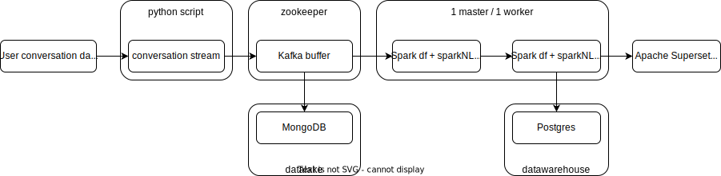

# Messaging application converstation analysis

# Overview
Modern messaging applications generate massive amounts of data through user interactions. Analyzing this data can be challenging without the right tools. This project leverages Apache tools to gather messages from a messaging application, process them, and provide a summarized overview.

This project is designed to gather messages from a messaging application and summarize them using Apache tools. It aims to provide a convenient way to analyze and understand the content of the messages exchanged within the messaging application.

## How it Works
The project follows these general steps:

1. Message Gathering:
Stream local dataset to reprduce live behaviour. Stores the messages in a Kafka topic.

2. Data Processing:
Apache Spark and Flink read messages from Kafka.
Applies data transformations and filters to clean and organize the data.
Stores processed data in Hadoop Distributed File System (HDFS) for further analysis.

3. Message Summarization:
Utilizes transformer model to create summaries an classifier to assign a category to each conversation.

4. Visualization:
Apache visualization tools (e.g., Apache Zeppelin) are used to generate graphical representations of the message data.




# Conversation processing 📤

## Conversation summarization
In order to summarize conversation, an abstractive summarization method is considered since extractive summarization method might not be as accurate. 
In order to natively run this model on an Apache cluster, various steps need to be adressed.
1. Selection of model from HuggingFace.
-> Transformers from philschmid/bart-large-cnn-samsum transformer is considered.
- Issue: There is no TF implementation.
-> Need to fine-tune original model from facebook/bart-large-cnn on philschmid implementation dataset ([SAMsum](https://huggingface.co/datasets/samsum)).

## Summary classification 📰
TBD

## Dataset
In order to stream conversation to apache cluster, dataset taken from:
[Common sense dialogues](https://github.com/alexa/Commonsense-Dialogues)

# Installation

## Setup
- Clone the repository to your local machine:

"""
bash
Copy code
git clone https://github.com/your-username/messaging-app-summarizer.git
cd messaging-app-summarizer
"""

- Install the required Python packages:
"""
Copy code
pip install -r requirements.txt
"""

## Usage
Configure Messaging Application API Credentials:
If your messaging application requires API credentials for accessing messages, make sure to provide them in the configuration file (e.g., config.yaml).

Start Apache Services:
Ensure all the necessary Apache services like Kafka, Spark, Hadoop, Flink, HBase, and ZooKeeper are up and running.
In order to launch the apache cluster, navigate to the docker folder and run the docker compose file.
```python
cd ./docker
docker-compose-up
```

Gather Messages:
Execute the message gathering script:
"""
Copy code
python gather_messages.py
"""

# To be done next 🛠
Following steps are considered:
[ ] Mobile app implementation
[ ] Model quantization
